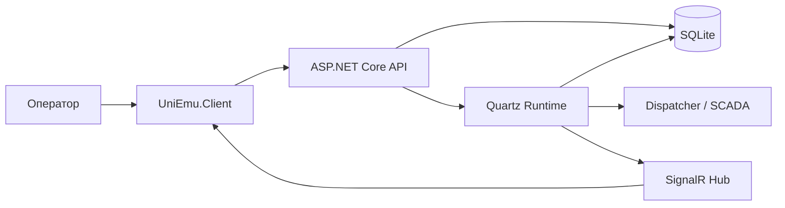

---
tags:
  - uniemu
  - документация
  - obsidian
---

# UniEmu

UniEmu - это система для управления парком программных эмуляторов промышленного оборудования. Проект помогает имитировать работу станков, ЧПУ, линий и других устройств, публиковать телеметрию в Dispatcher/SCADA по Universal-протоколу, хранить управляющие программы и описывать поведение тегов через генераторы, сценарии и C#-скрипты.

Эта папка оформлена как Obsidian-совместимая база знаний. Откройте каталог `docs/obsidian` как vault или добавьте его в существующий vault. Все основные страницы связаны через wikilinks.

## С чего начать

- [[01 Назначение и обзор]] - человеческое объяснение, для чего нужен проект.
- [[02 Быстрый старт]] - запуск backend, frontend и Docker Compose.
- [[03 Пользовательские сценарии]] - как система выглядит с точки зрения оператора.
- [[04 Архитектура]] - общая схема backend, frontend, БД, runtime и Dispatcher.
- [[06 Эмуляторы и теги]] - главная предметная модель UniEmu.
- [[07 Runtime и Dispatcher]] - как эмулятор генерирует и отправляет данные.
- [[08 CSX-скрипты и IntelliSense]] - C# scripting, состояние, REST из скриптов и Monaco.
- [[09 Frontend-консоль]] - страницы веб-интерфейса.
- [[10 REST API и realtime]] - HTTP API и SignalR-события.
- [[11 Конфигурация и эксплуатация]] - настройки, Docker, логи, ограничения запуска.
- [[12 Ограничения и развитие]] - известные ограничения и технический долг.
- [[13 Термины и источники]] - словарь и карта файлов, по которым составлена документация.
- [[14 Вычисление тегов]] - подробное пользовательское описание static/generator/script/scenario и функций генератора.
- [[15 Сценарии тегов]] - как собирать timeline из сегментов и как читать preview-графики.
- [[16 Редактор скриптов и API]] - возможности Monaco-редактора, IntelliSense и доступный CSX API.
- [[17 PWA и офлайн-режим]] - установка веб-консоли, service worker, кэширование и реальные границы offline-режима.
- [[18 Сценарии применения эмулятора]] - наброски промышленных кейсов: ЧПУ, печь, линии, роботы, насосные станции и приемка SCADA.
- [[19 Backend-аудит документации]] - состояние XML/Markdown-документации backend и оставшиеся зоны для аудита.

## Быстрая карта

## Основные понятия

| Понятие | Где читать | Коротко |
| --- | --- | --- |
| Эмулятор | [[06 Эмуляторы и теги#Эмулятор]] | Виртуальная машина или устройство, которое публикует telemetry payload. |
| Тег | [[06 Эмуляторы и теги#Тег]] | Отдельное значение в пакете телеметрии. |
| Вычисление тега | [[14 Вычисление тегов]] | Способ получить значение: static, generator, scenario, script и другие. |
| Runtime | [[07 Runtime и Dispatcher]] | Quartz jobs, которые рассчитывают теги и отправляют их наружу. |
| Dispatcher | [[07 Runtime и Dispatcher#Обмен с Dispatcher]] | Внешняя система, принимающая мониторинг и обменивающаяся CNC-файлами. |
| CSX-скрипт | [[08 CSX-скрипты и IntelliSense]] | C#-скрипт для вычисления значений тегов. |
| CNC-программа | [[06 Эмуляторы и теги#CNC-программы]] | G-code или другой файл управляющей программы. |
| Realtime | [[10 REST API и realtime#SignalR]] | SignalR-обновления для UI без ручного refresh. |
| PWA | [[17 PWA и офлайн-режим]] | Устанавливаемая веб-консоль с кэшем frontend-ресурсов. |

## Статус документации

Документация описывает текущее состояние кода в репозитории на 2026-05-20. В проекте уже были существующие заметки и планы в `docs/superpowers`; этот vault не заменяет их, а дает цельное пользовательское и техническое описание проекта.
