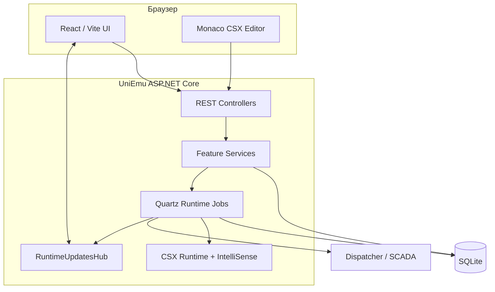
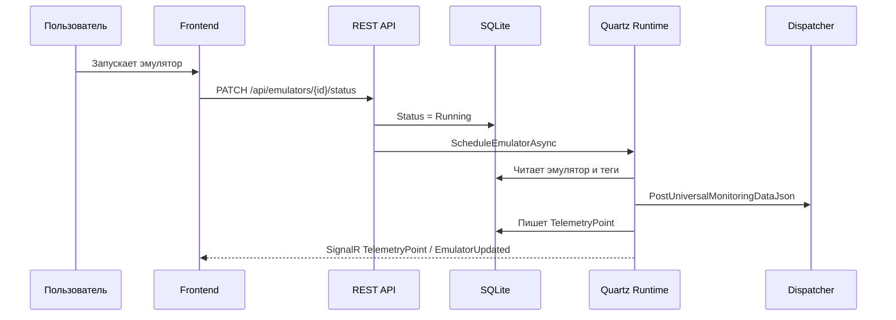

---
tags:
  - uniemu
  - архитектура
---

# Архитектура

UniEmu устроен как монорепозиторий с ASP.NET Core backend, React/Vite frontend, отдельным проектом scripting API и тестовым проектом.

## Компоненты

## Репозиторий

| Путь | Назначение |
| --- | --- |
| `UniEmu/` | Backend, REST API, EF Core, runtime, scripting services, SignalR. |
| `UniEmu.Client/` | Frontend-консоль на React/Vite. |
| `UniEmu.Scripting.Api/` | Безопасная публичная поверхность, доступная CSX-скриптам. |
| `UniEmu.Tests/` | Тесты backend, runtime, scripting, services и части frontend-static checks. |
| `docs/` | Документация, планы и этот Obsidian vault. |

## Backend

Backend стартует из `UniEmu/Program.cs`.

Он:

- применяет кодировку, culture и timezone;
- настраивает порт через `UniEmu:Port`;
- подключает Autofac и Serilog;
- регистрирует controllers, OpenAPI, SignalR, EF Core, HTTP clients и runtime;
- инициализирует БД;
- восстанавливает runtime state;
- планирует running-эмуляторы;
- отдает static frontend assets;
- мапит REST controllers и `/hubs/runtime-updates`.

Подробнее: [[10 REST API и realtime]], [[11 Конфигурация и эксплуатация]].

## Backend feature layers

Backend разделен по функциональным зонам:

- `Features/Emulators` - CRUD эмуляторов, статус, XML-шаблон Dispatcher.
- `Features/Tags` - CRUD тегов, CSX-валидация, reschedule running-эмулятора.
- `Features/Scripts` - CRUD `.csx`, Roslyn-валидация, очистка compilation cache.
- `Features/CncPrograms` - хранение управляющих программ.
- `Features/Telemetry` - чтение и ingest telemetry.
- `Features/Events` - системные события.
- `Runtime` - Quartz jobs, генераторы, публикация, Dispatcher protocol.
- `Runtime/Scripting` - выполнение CSX, IntelliSense, language services.
- `Realtime` - SignalR hub и сервис публикации обновлений.

## Хранилище

Основное хранилище - SQLite через EF Core. Схема описана в `UniEmu/Data/UniEmuDbContext.cs`.

Ключевые таблицы:

- `Emulators`;
- `EmulatorTags`;
- `ScriptFiles`;
- `ScriptRuntimeStates`;
- `CncPrograms`;
- `TelemetryPoints`;
- `SystemEvents`.

Подробнее: [[05 Модель данных]].

## Frontend

Frontend использует:

- React 19;
- Vite;
- TanStack Router;
- Zustand;
- Tailwind CSS;
- Radix UI wrappers;
- Monaco Editor;
- Recharts;
- SignalR client;
- PWA через `vite-plugin-pwa`.

Он не генерирует API-клиент, а использует ручной typed fetch wrapper `src/api/uniemu-api.ts`. Глобальный cache/UI state живет в `src/store/uniemu-store.ts`.

Подробнее: [[09 Frontend-консоль]].

## Поток данных

