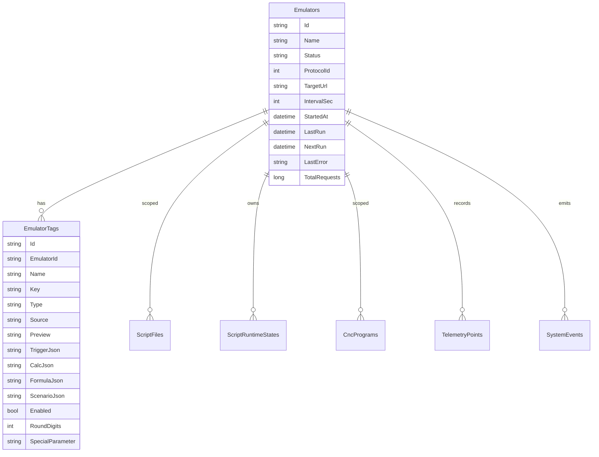

---
tags:
  - uniemu
  - данные
  - sqlite
---

# Модель данных

Данные UniEmu хранятся в SQLite через EF Core. Контекст находится в `UniEmu/Data/UniEmuDbContext.cs`.

## Основные сущности

## Emulators

Эмулятор - верхнеуровневая единица конфигурации. Он описывает один имитируемый станок или устройство.

Важные поля:

- `Status` - `Running`, `Stopped`, `Error`, `Idle`;
- `ProtocolId` - идентификатор, который используется как `MachineIntegrationId`;
- `TargetUrl` - адрес Dispatcher/SCADA;
- `IntervalSec` - период основного publish job;
- `StartedAt` - начало текущего запуска;
- `LastRun`, `NextRun` - время последней и следующей публикации;
- `LastError` - последняя ошибка runtime или Dispatcher; заполняется не только при `Status = Error`, но и при ошибках расчета/расписания тегов или отправки, когда статус может оставаться `Running`;
- `TotalRequests` - счетчик успешных публикаций.

## EmulatorTags

Тег принадлежит одному эмулятору и описывает одно значение telemetry payload.

Конфиги хранятся JSON-строками:

- `TriggerJson` - как и когда рассчитывать тег;
- `CalcJson` - параметры генератора;
- `FormulaJson` - inline script или `ScriptId`;
- `ScenarioJson` - timeline сценария.

Такой подход упрощает схему БД, но сложные запросы по внутренним полям JSON потребуют отдельной доработки.

## ScriptFiles

CSX-скрипты не лежат на диске. Они являются записями в таблице:

- `Name`;
- `Scope`;
- `EmulatorId`;
- `Content`;
- `UpdatedAt`;
- `SizeBytes`.

Индекс `(Scope, EmulatorId, Name)` уникален, поэтому в одной области видимости нельзя создать два скрипта с одинаковым именем.

## ScriptRuntimeStates

Persistent state для CSX-скриптов.

Ключ логически состоит из:

- `EmulatorId`;
- `ScriptKey`, например `inline:{tagId}` или `script:{scriptId}`.

Сами значения хранятся как JSON snapshot. Runtime использует это для `UniEmu.State`.

## CncPrograms

CNC-программа хранит имя, scope, optional `EmulatorId`, описание, содержимое, размер и даты. Scope бывает:

- `shared`, программа видна всем эмуляторам;
- `emulator`, программа видна только конкретному эмулятору.

Текущая модель хранит content строкой. Для полной byte-safe совместимости с Dispatcher binary-файлы требуют отдельного развития.

## TelemetryPoints

Telemetry point содержит:

- `EmulatorId`;
- `Timestamp`;
- `ValuesJson`.

Значения сохраняются для локальной истории и графиков UI. Runtime записывает telemetry point перед попыткой отправки в Dispatcher.

## SystemEvents

События фиксируют ошибки и важные состояния runtime:

- ошибка отправки telemetry;
- ошибка вычисления тега;
- ошибка once-тега `onStart`/`onStop`;
- некорректное расписание interval/cron-тега;
- блокировка мониторинга Dispatcher;
- пользовательские events через API.

Frontend получает последние события через REST и realtime.

Для оперативного отображения состояния system event дублируется в `Emulators.LastError` там, где ошибка влияет на работоспособность эмулятора. Дашборд использует `LastError` как runtime-health признак, даже если `Status` еще `Running`.

## Удаление

Удаление эмулятора каскадно удаляет связанные:

- теги;
- emulator-scoped скрипты;
- runtime states;
- emulator-scoped CNC-программы;
- telemetry points;
- system events.
