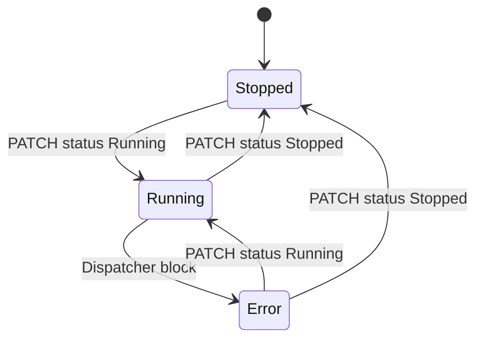

---
tags:
  - uniemu
  - runtime
  - dispatcher
---

# Runtime и Dispatcher

Runtime - это часть UniEmu, которая превращает сохраненную конфигурацию в реальную работу эмуляторов.

## Жизненный цикл эмулятора



`Status` отражает управляющее состояние эмулятора, но не исчерпывает runtime health. Ошибка отправки telemetry, ошибка вычисления тега, ошибка once-тега или некорректное расписание тега могут оставить `Status = Running`, но заполнить `LastError`. Для UI это считается ошибочным состоянием: дашборд относит такой эмулятор к ошибкам, показывает красный badge и поднимает карточку выше рабочих.

При старте приложения backend:

1. инициализирует БД;
2. восстанавливает runtime values из `EmulatorTags.Preview`;
3. планирует все эмуляторы, которые в БД имеют статус `Running`.

При ручном запуске эмулятора:

1. выставляется `StartedAt`;
2. очищается `LastError`;
3. выполняются once-теги `onStart`;
4. создаются Quartz jobs;
5. UI получает realtime `EmulatorUpdated`.

При остановке:

1. выполняются once-теги `onStop`;
2. jobs эмулятора удаляются;
3. in-memory state очищается;
4. dirty preview-значения flush-ятся в БД.

## Quartz jobs

| Job | Назначение |
| --- | --- |
| `EmulatorPublishJob` | Главный цикл публикации telemetry. |
| `TagValueJob` | Отдельный пересчет interval/cron-тега. |
| `DispatcherBlockCheckJob` | Проверка, не заблокирован ли мониторинг со стороны Dispatcher. |

`EmulatorScheduleService` перед новым расписанием удаляет старые jobs эмулятора, затем создает новые.

## Расчет значений

Publish job собирает значения всех тегов. Источник зависит от `TagSource`:

- preview для static-like значений;
- генератор для `generator`;
- timeline для `scenario`;
- CSX runtime для `script`, `formula`, `formulaScript`;
- runtime store для значений, которые уже посчитал `TagValueJob`.

Значение приводится к типу тега. Для `double` применяется `RoundDigits`, если он задан.

После базового расчета publish job дополнительно обогащает CNC-специальные параметры:

- читает имя основной программы из значения тега `PrgName`;
- читает имя подпрограммы из значения тега `Subprogram`;
- ищет видимые CNC-программы: shared и программы текущего эмулятора;
- для `FrameNum` и `FrameText` выбирает подпрограмму, если она задана и найдена, иначе основную программу;
- считает номер строки по формуле `floor(elapsedSec / max(1, IntervalSec)) % lines.Length`;
- записывает текущий номер кадра и текст строки обратно в preview и runtime state.

Нумерация кадров начинается с `0`. После последней строки счетчик зацикливается и снова возвращается к первому кадру.

## Ошибки runtime

Ошибки runtime фиксируются в двух местах:

- `SystemEvents` получает событие уровня `error`;
- `Emulators.LastError` получает текст последней ошибки, чтобы общее состояние эмулятора было видно в списках и на дашборде.

`EmulatorPublishJob` очищает `LastError` в начале успешного цикла и снова заполняет его, если ломается расчет тега, скриптовая формула, отправка monitoring payload или обмен файлами с Dispatcher. Если расчет скриптового тега упал внутри publish job, runtime создает system event, сохраняет ошибку в `LastError` и использует fallback-значение генератора/preview, когда это возможно.

`TagValueJob` при ошибке interval/cron-тега создает system event, пишет ошибку в `LastError`, инвалидирует cache эмулятора и публикует realtime `EmulatorUpdated`. Это важно для тегов, которые считаются отдельно от основного publish interval: даже если основной статус все еще `Running`, UI увидит проблему без ожидания ручного refresh.

`EmulatorScheduleService` так же пишет `LastError` при ошибках once-тегов `onStart`/`onStop` и при некорректном cron/trigger, из-за которого job тега не может быть запланирован.

## Runtime state

В памяти значения хранятся в `TagRuntimeStateStore`:

```text
emulatorId -> tagId -> TagRuntimeValue
```

Это нужно, чтобы:

- publish job мог использовать последнее значение тега;
- interval/cron теги не пересчитывались лишний раз;
- UI получал `TagValue` realtime update;
- CSX side effects могли менять static-теги.

На штатном shutdown часть state сохраняется обратно в `Preview`. Script state хранится надежнее, в отдельной таблице `ScriptRuntimeStates`.

## Monitoring payload

Runtime отправляет POST на:

```text
/IndustryManagment/WebIntegration/PostUniversalMonitoringDataJson
```

Форма запроса:

```json
{
  "MachineIntegrationId": 18,
  "UseInnerId": true,
  "ListValues": [
    { "Key": "PowerOn", "Value": true },
    { "Key": "PrgName", "Value": "MAIN.nc" }
  ]
}
```

В payload попадают только `Enabled` теги. `MachineIntegrationId` берется из `ProtocolId` эмулятора.

Ожидаемый ответ Dispatcher содержит:

```text
FileType=0;GetFile=0
```

Если формат ответа неожиданный, runtime считает это protocol error.

## Обмен с Dispatcher

### FileType

Если Dispatcher возвращает `FileType=1`, UniEmu отправляет основную CNC-программу. Если `FileType=2`, отправляет подпрограмму.

Для отправки runtime сначала берет рассчитанные значения тегов `PrgName` и `Subprogram`, затем резолвит их в CNC-программы по имени. Сравнение имени нечувствительно к регистру. Среди совпадений приоритет получают программы с описанием `[dispatcher-received]`, затем программы текущего эмулятора, затем shared-программы.

Отправка идет на:

```text
/IndustryManagment/WebIntegration/PostFileUniversal
```

Файл режется на чанки по 4096 байт:

- в первом блоке есть `Hash = Base64(MD5(bytes))`;
- каждый блок содержит `FileUP = Base64(chunk)`;
- последний блок содержит `EOF = "1"`;
- Dispatcher должен отвечать `ok`.

### GetFile

Если Dispatcher возвращает `GetFile=1`, UniEmu запрашивает файл:

```text
/IndustryManagment/WebIntegration/GetFileUniversal?machine_id={id}&file_type=1
/IndustryManagment/WebIntegration/GetFileUniversal?machine_id={id}&file_type=0
```

Сначала читается hash, затем блоки файла до `EOF`. Hash mismatch логируется как warning. Полученная программа сохраняется как emulator-scoped CNC-программа с описанием `[dispatcher-received] Получена от Dispatcher`.

После успешного приема файла runtime также обновляет static-тег со специальным параметром `PrgName`: в его `Preview` и runtime state записывается имя полученной программы вида `received_program_machine_id_<id>.txt`. Это позволяет следующему циклу использовать полученный файл как основную УП.

## Проверка блокировки мониторинга

`DispatcherBlockCheckJob` вызывает:

```text
/IndustryManagment/WebIntegration/GetIsMonitoringBlocked?machine_id={id}
```

Ответ:

- `0` - мониторинг не заблокирован;
- `1` - мониторинг заблокирован.

При `1` эмулятор переводится в `Error`, `LastError` заполняется, `NextRun` очищается, создается system event и публикуется realtime update.

## Ограничения runtime

- Runtime можно полностью отключить настройкой `UniEmu:DisableRuntime`.
- HTTP client Dispatcher имеет timeout 5 секунд.
- Для Dispatcher включено принятие любых SSL-сертификатов.
- In-memory state не распределенный.
- `TagRuntimeStateStore` может потерять последние значения при аварийном завершении.
- CSX security validator снижает риск, но не является полноценной sandbox-песочницей с лимитами CPU и памяти.
